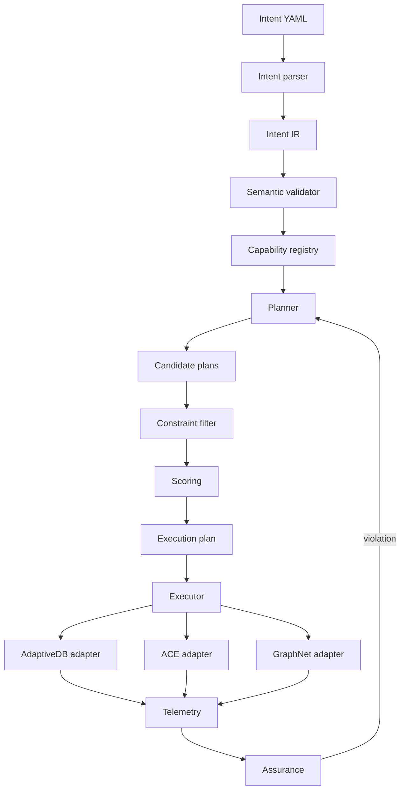

# AICP 0.1 architecture

## Design principle

AICP is the **control plane**. AdaptiveDB, ACE and GraphNet are **execution targets**. The control plane must not import implementation details from those engines.

## Architectural invariants

1. **Intent is declarative.** Users describe outcomes and boundaries, not concrete engine commands.
2. **Hard constraints dominate optimization.** A cheap plan that breaks durability or an SLO is infeasible, not merely lower-ranked.
3. **Planning is separated from execution.** `ExecutionPlan` is immutable and explainable before it is applied.
4. **Adapters isolate engines.** AICP does not depend on AdaptiveDB/ACE/GraphNet internal modules.
5. **Unknown is a first-class assurance state.** Missing telemetry must never be interpreted as success.
6. **Feedback closes the loop.** Runtime violations recommend replanning.
7. **0.1 is deterministic.** No random/ML decision logic is used except UUID generation for plan identity.

## Milestone 0.1 plan strategies

The planner intentionally generates three transparent baseline candidates:

- `latency-first`: row storage + fast compression + Raft;
- `balanced-adaptive`: hybrid storage + balanced compression + graph-scoped coordination;
- `cost-storage-first`: column storage + dense compression + partition coordination.

The estimates are synthetic demo values. They validate the control-plane mechanics, **not** real performance claims about AdaptiveDB, ACE or GraphNet.

## Future replacement points

The following 0.1 components are intentionally replaceable:

- static capability registry → dynamic capability discovery;
- heuristic candidate generator → optimizer/constraint solver;
- synthetic cost estimates → calibrated cost model;
- mock adapters → real ADB/ACE/GraphNet adapters;
- in-process telemetry → metrics/event ingestion;
- rule assurance → SLO windows and statistical assurance.
